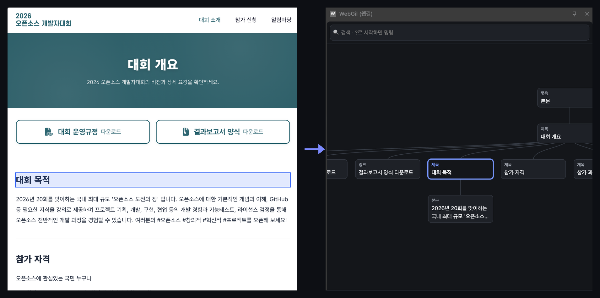
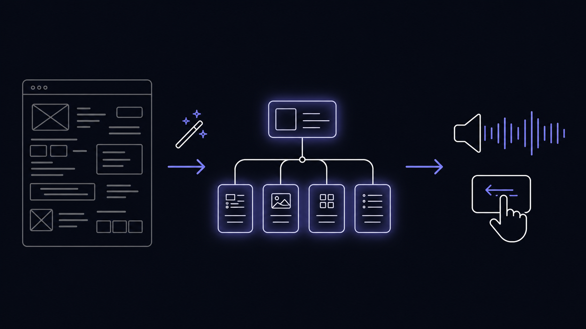
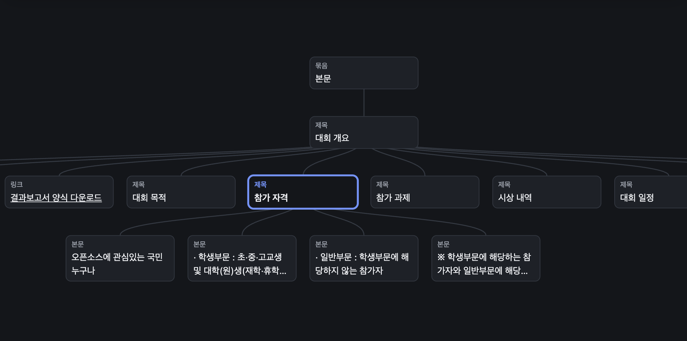
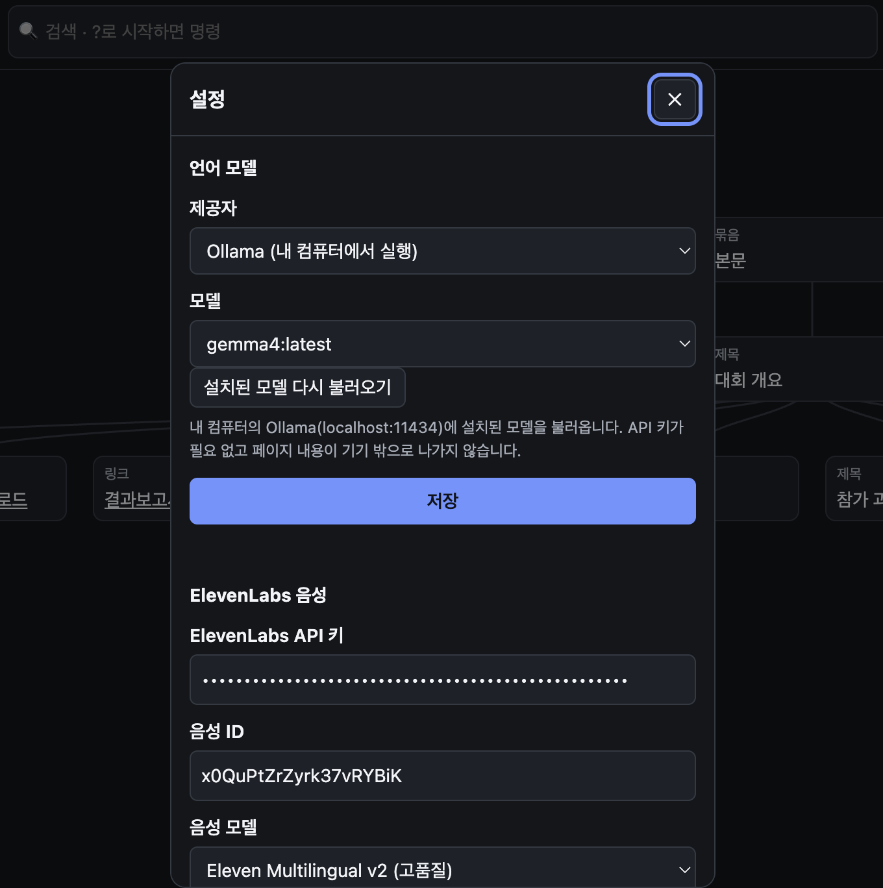
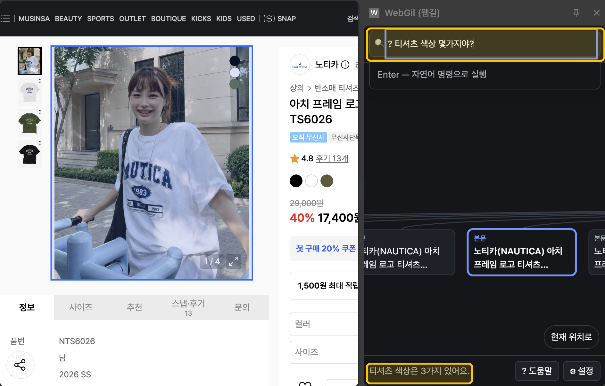

<div align="center">

# WebGil (웹길)



**웹페이지를 의미적 문서 트리로 재구성해, 시각장애인이 문서를 "훑어" 탐색하고 자연스러운 음성으로 듣는 오픈소스 스크린리더**

[](LICENSE)
[](https://github.com/linklingj/WebGil/actions/workflows/ci.yml)
[](https://nodejs.org)
[](https://pnpm.io)
[](https://developer.chrome.com/docs/extensions/mv3/intro/)

[소개](#소개) · [주요 기능](#주요-기능) · [시작하기](#시작하기) · [사용법](#사용법) · [프로젝트 구조](#프로젝트-구조) · [기여하기](#기여하기)


</div>

---

## 소개



기존 스크린리더는 DOM/시각 순서를 따라 페이지를 **위에서 아래로 선형 낭독**한다. 그래서 원하는 정보에 도달하려면 키를 수십 번 눌러야 하고, 마크업이 부실한 사이트에서는 heading·landmark 탐색조차 제대로 동작하지 않는다.

**시각장애인에게 필요한 것은 "화면에 보이는 것을 그대로 읽어주는 것"이 아니라, 문서의 논리적 구조를 빠르게 파악하고 원하는 곳으로 점프하는 능력이다.**

WebGil은 웹페이지를 픽셀 순서가 아니라 **의미적 문서 트리**로 재구성한다. 사용자는 목차 수준의 최상위 레벨에서 시작해 관심 있는 항목만 골라 계층적으로 파고들고, 트랙패드 제스처·방향키·자연어 명령으로 조작하며, 자연스러운 TTS로 듣는다.

전체 기획과 문제 정의는 [`docs/00_PLAN/plan.md`](docs/00_PLAN/plan.md)에 있다.

## 주요 기능

### 🌳 구조적 재구성



DOM과 접근성 트리(AX Tree)를 병합해 계층적 문서 트리를 만든다. 규칙 기반(heading·landmark·본문 휴리스틱)을 1차 경로로 쓰기 때문에 빠르고 결정론적이며, **원본 DOM 노드 핸들을 그대로 보존**해 이후 클릭·입력 실행에 바로 쓸 수 있다. 마크업이 부실한 페이지는 `Alt+Shift+R`로 LLM 후처리 재구성을 돌린다.

### 🔊 자연스러운 TTS & AI 모델 선택



TTS와 LLM 둘 다 **로컬 기본값 + 선택적 API**로 설계했다 — 패널 설정 하나에서 나란히 고른다.

- **TTS**: 브라우저 내장 Web Speech API가 기본이고, 원하면 ElevenLabs로 고품질 음성을 쓴다. 낭독 속도는 설정에서 조절한다. 한국어 숫자 발음 정규화, 표 구조 낭독, 이동 지점 안내 등 실사용에 필요한 규칙이 들어 있다. API가 없거나 실패하면 내장 음성으로 폴백한다.
- **AI 모델**: 언어 모델 제공자를 Ollama(로컬) · OpenAI · Google Gemini · Anthropic 중에서 고른다. Ollama를 고르면 `설치된 모델 다시 불러오기`로 내 컴퓨터에 있는 모델 목록을 바로 불러와 API 키 없이 쓴다

### 💬 자연어 명령



검색창에 `?`로 시작해 "로그인창 눌러줘", "가격 정보 요약해줘" 같은 명령을 입력하면 LLM이 트리에서 대상 노드를 지목하고 액션을 실행한다. 제공자는 **Ollama(로컬) · OpenAI · Google Gemini · Anthropic** 중에 고른다. LLM이 만드는 것은 실행 가능한 계획 뿐이고, 실제 실행은 검증을 거친 액션 실행기가 담당한다.

## 기술 스택

| 영역 | 사용 기술 |
|---|---|
| 언어 · 빌드 | TypeScript 5.7, esbuild, pnpm 워크스페이스 모노레포 |
| 셸 | Chrome Extension Manifest V3 (content script + service worker + Side Panel) |
| 구조 추출 | DOM 순회 + ARIA/AX 시맨틱 규칙 + 자체 본문 휴리스틱 |
| 트리 시각화 | d3-hierarchy · d3-zoom · d3-selection |
| TTS | Web Speech API (기본) · ElevenLabs Multilingual v2 (선택) |
| LLM | Ollama (로컬) · OpenAI Responses · Google Gemini · Anthropic Messages |
| 테스트 | `node --test` + tsx + jsdom (프레임워크 없음) |
| CI | GitHub Actions (build · test · typecheck) |

## 아키텍처

핵심 설계 원칙은 **셸 독립 코어**다. 구조추출·트리모델·내비게이션·TTS·LLM은 "페이지에 어떻게 접근하는지" 모른다. 페이지 접근과 제어는 전부 `CaptureSource` 인터페이스 하나 뒤에 숨는다.

```
[웹페이지]
   │  CaptureSource 어댑터  (확장 · 데스크톱 · 헤드리스)
   ▼
[구조 추출 엔진] ── DOM + AX Tree + 휴리스틱 / LLM 재구성
   │
   ▼
[문서 트리 모델] ── 레벨 · 텍스트 · 상호작용 노드 (+ 원본 핸들)
   │
   ├──▶ [내비게이션 엔진] ◀── 트랙패드 제스처 / 키보드 / 패널
   │           ├──▶ [TTS 엔진 추상화] ── 로컬 | API
   │           └──▶ [LLM 명령 엔진]  ── 로컬 | API
   ▼
[액션 실행기] ── CaptureSource.execute()로 클릭·입력·포커스를 원본 페이지에 반영
```

단위 엔진별 설계 문서는 [`docs/01_SYSTEM/`](docs/01_SYSTEM/README.md)에 있다.

## 시작하기

### 사전 요구사항

| 항목 | 버전 | 비고 |
|---|---|---|
| [Node.js](https://nodejs.org) | 20 이상 | CI 기준 20 |
| [pnpm](https://pnpm.io) | 9.15.9 | `npm i -g pnpm` 또는 `corepack enable` |
| Chrome (또는 Chromium 계열) | MV3 · Side Panel 지원 버전 | 개발자 모드 필요 |
| [Ollama](https://ollama.com) | 선택 | 로컬 LLM으로 쓸 때만 |

### 설치와 빌드

```bash
git clone https://github.com/linklingj/WebGil.git
cd WebGil

pnpm install
pnpm --filter @webgil/extension build
```

`apps/extension/dist/`에 `content.js` · `background.js` · `panel/` · `manifest.json`이 생성된다. 이 폴더가 Chrome에 로드할 대상이다.

### Chrome에 로드

1. `chrome://extensions` 접속 → 우상단 **개발자 모드** 켜기
2. **압축해제된 확장 프로그램을 로드** → `apps/extension/dist` 선택
3. 아무 웹페이지를 열고 툴바의 WebGil 아이콘 클릭 → 사이드패널이 열린다

코드를 수정한 뒤에는 `build` → `chrome://extensions`에서 확장 새로고침 → **대상 페이지도 새로고침**해야 반영된다.

### LLM 설정 (선택)

**로컬 (Ollama, 권장 — 페이지 내용이 기기 밖으로 안 나감)**

```bash
ollama pull llama3.2
OLLAMA_ORIGINS='chrome-extension://*' ollama serve
```

패널 설정(`Alt` + `,`) → 제공자 **Ollama** → 설치된 모델 목록에서 선택 후 저장. 주소는 `http://localhost:11434` 고정이다(확장 권한이 manifest에 정적으로 박힌다). `403`이 뜨면 Ollama가 확장 오리진을 막은 것이므로 위처럼 `OLLAMA_ORIGINS`를 지정해 다시 띄운다.

**API (OpenAI / Gemini / Anthropic)**

패널 설정에서 제공자·모델·API 키를 입력한다. 키는 `chrome.storage`의 신뢰된 컨텍스트에만 저장되며 content script로 내려가지 않는다.

## 사용법

### 페이지에서 (패널 없이도 동작)

포커스가 입력창 밖에 있을 때:

| 키 | 동작 |
|---|---|
| `Alt` + `↓` / `→` | 같은 레벨 다음 항목 |
| `Alt` + `↑` / `←` | 같은 레벨 이전 항목 |
| `Alt` + `Enter` | 하위 레벨 진입 — 하위가 없으면 실행(링크·버튼 클릭, 입력칸 포커스) |
| `Alt` + `Backspace` | 상위 레벨 복귀 |
| `Alt` + `Shift` + `T` | 터치패드 제스처 모드 켜기 / 끄기 |
| `Alt` + `Shift` + `R` | LLM으로 문서 구조 다시 정리 |

이동한 노드는 화면에 오버레이로 강조되고 한국어 음성으로 낭독된다.

### 어디서나 (브라우저 전역 단축키)

| 키 | 동작 |
|---|---|
| `Alt` + `,` | 설정 열기 / 닫기 |
| `Alt` + `.` | 도움말 열기 / 닫기 |
| `Alt` + `Shift` + `F` | 패널 검색창으로 이동 |
| `Alt` + `Shift` + `G` | 탐색 안내 켜기 / 끄기 |

다른 확장과 겹치면 Chrome이 조용히 등록을 건너뛴다. `chrome://extensions/shortcuts`에서 변경할 수 있다.

전체 조작 목록은 확장 안에서 `Alt` + `.`(도움말)로 확인할 수 있다. 이 표와 도움말 화면은 [`apps/extension/src/navigation/shortcuts.ts`](apps/extension/src/navigation/shortcuts.ts)의 `SHORTCUTS` 하나에서 나온다.

## 프로젝트 구조

```
WebGil/
├── packages/core/            # 셸 독립 코어 (@webgil/core)
│   └── src/
│       ├── capture-source.ts   # 01 페이지 접근 인터페이스 — 유일한 교체 지점
│       ├── structure.ts        # 02 구조 추출 엔진 (DOM+AX → 트리)
│       ├── tree-refine.ts      # 02-L LLM 트리 재구성 (재배치만, 핸들 보존)
│       ├── tree.ts             # 03 문서 트리 모델 + 검색·스냅샷 헬퍼
│       ├── navigation.ts       # 04 내비게이션 엔진 (커서 이동)
│       ├── tts.ts / narration.ts / korean-number.ts   # 05 TTS 추상화·낭독 규칙
│       ├── llm-command.ts      # 06 자연어 → 검증 가능한 명령 계획
│       ├── llm-provider.ts     # 06 제공자 어댑터 (Ollama/OpenAI/Gemini/Anthropic)
│       ├── action.ts           # 07 액션 실행기
│       └── dom-semantics.ts    # DOM → 의미 규칙 (셸과 공유)
│
├── apps/extension/           # ExtensionSource — Chrome MV3 셸 (대회 MVP)
│   └── src/
│       ├── capture/            # CaptureSource 구현
│       ├── navigation/         # 단축키·터치패드 제스처·탐색 안내
│       ├── tts/                # Web Speech · ElevenLabs 엔진
│       ├── llm/                # 명령 팔레트
│       ├── panel/              # 08 사이드패널 UI (트리 뷰·검색·설정·도움말)
│       ├── content.ts          # content script 진입점
│       └── background.ts       # service worker
│
├── apps/desktop/             # DesktopSource — Electron 셸 (Phase 6, 스텁)
├── tools/bench/              # PlaywrightSource — 코퍼스 벤치 하니스
└── docs/
    ├── 00_PLAN/plan.md         # 전체 기획서
    ├── 01_SYSTEM/              # 단위 엔진 설계 문서 (01~08)
    ├── 03_RESEARCH/            # 레퍼런스 · 테스트 사이트 목록
    └── git-convention.md       # 브랜치 · 커밋 · PR 규칙
```

## 개발

### 테스트 · 타입 검사

```bash
pnpm -r test        # core + extension (node --test, 프레임워크 없음)
pnpm -r typecheck
pnpm -r build
```

### 벤치 하니스

실제 사이트 코퍼스에서 구조 추출 트리 품질을 배치 검증한다.

```bash
pnpm --filter @webgil/bench observe            # 사이트 목록 전체 — 트리 요약 출력
pnpm --filter @webgil/bench observe <url> ...

pnpm --filter @webgil/bench refine             # 규칙 트리 vs LLM 재구성 트리 비교
```

`refine`은 루트 `.env`(→ [`.env.example`](.env.example))에 제공자·모델·API 키가 있으면 실제 LLM을 호출하고, 없으면 **드라이런**으로 각 페이지가 재구성 컨텍스트 한도 안에 들어오는지만 잰다.

## 의존성

런타임에 번들되는 것은 d3 세 패키지뿐이고, 나머지는 전부 빌드·테스트 도구다.

| 패키지 | 버전 | 라이선스 | 용도 |
|---|---|---|---|
| [d3-hierarchy](https://github.com/d3/d3-hierarchy) | 3.1.2 | ISC | 문서 트리의 계층 레이아웃 계산 |
| [d3-zoom](https://github.com/d3/d3-zoom) | 3.0.0 | ISC | 트리 뷰 팬 · 줌 카메라 제어 |
| [d3-selection](https://github.com/d3/d3-selection) | 3.0.0 | ISC | d3-zoom을 패널 DOM에 연결 |
| [esbuild](https://github.com/evanw/esbuild) | 0.24.x | MIT | 확장 번들 빌드 |
| [TypeScript](https://github.com/microsoft/TypeScript) | 5.7+ | Apache-2.0 | 타입 검사 · 컴파일 |
| [tsx](https://github.com/privatenumber/tsx) | 4.19+ | MIT | 테스트 · 벤치 스크립트 실행 로더 |
| [jsdom](https://github.com/jsdom/jsdom) | 25.0.1 | MIT | 단위 테스트 · 벤치의 가상 DOM |

외부 API(OpenAI · Gemini · Anthropic · ElevenLabs)는 **사용자가 본인 키를 입력한 경우에만** 동작하는 선택 경로다.

전체 고지는 [`THIRD_PARTY.md`](THIRD_PARTY.md)를 참고한다.

## 기여

1. `develop`에서 `feature/<설명-kebab-case>` 브랜치를 만든다
2. Conventional Commits 형식으로 커밋한다 (`feat:`, `fix:`, `docs:`, `refactor:`, `test:`, `chore:`)
3. `pnpm -r test && pnpm -r typecheck`를 통과시킨다
4. `develop`으로 PR을 연다 ([템플릿](.github/PULL_REQUEST_TEMPLATE.md) 사용, Squash and merge 권장)

브랜치·커밋·PR 규칙 전문은 [`docs/git-convention.md`](docs/git-convention.md)에 있다. 기획과 어긋나는 구현을 하기 전에는 [`docs/00_PLAN/plan.md`](docs/00_PLAN/plan.md)와 맞는지 먼저 확인한다.

버그 제보와 기능 제안은 [이슈](https://github.com/linklingj/WebGil/issues)로 남겨 주세요.

## 라이선스

[MIT](LICENSE)
